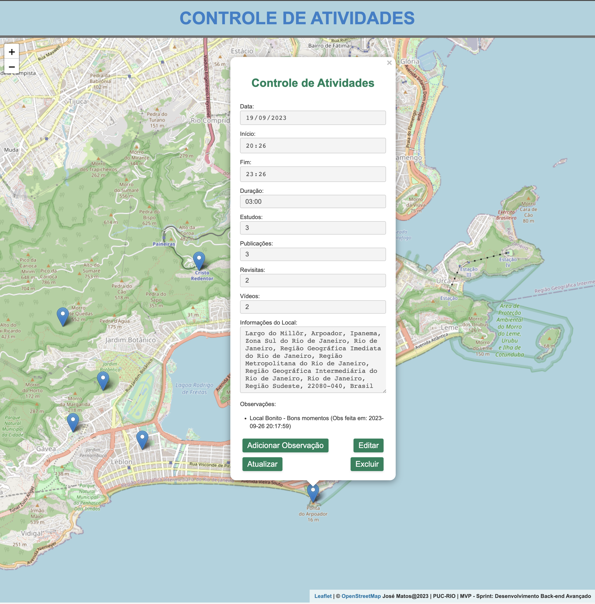

#
&nbsp;
&nbsp;

***MVP PUC-Rio-JRMJ SP2 - Sistema Integrado***

🚀 Bem-vindo ao repositório integrado do Sistema de controle de atividades de serviço de campo! Este projeto é o marco de conclusão da *Sprint 2 do Curso de Desenvolvimento Full Stack na PUC-Rio*.

# Sobre o MVP
Desenvolvemos esta aplicação para auxiliar o "Publicador de Boas Novas" a registrar suas atividades diárias de trabalho. Utilizando a  [OpenStreetMap (OSM) Nominatim API](https://nominatim.org/release-docs/develop/api/Overview/) é possível obter nomes de lugares e detalhes com base nas coordenadas do local. 

## Tecnologias Utilizadas
- 
- 
- 
- 
- 
- 
- 
- 
- 
- 

📺 [Vídeo de Visão Geral do Projeto](https://youtu.be/mD65-vTK5FE)

## O sistema está organizado em submódulos:

* [Backend](https://github.com/mjosejunior/mvp_jrmj_sp2_back.git)
* [Frontend](https://github.com/mjosejunior/mvp_jrmj_sp2_front.git)

## Como Executar o Sistema Integrado

## Com Docker - 

1. Certifique-se de ter o Docker e o Docker Compose instalados.

2. Clone este repositório, que inclui os submódulos:
```bash
git clone --recursive https://github.com/mjosejunior/mvp_jrmj_sp2.git
```
3. No diretório principal, onde o `docker-compose.yml` está localizado, execute:
```bash
docker-compose up --build
```

## Acesse:

*Frontend*: `http://localhost`

*Backend*: `http://localhost:5001`

*Para executar individualmente, sem Docker, consulte as instruções nos repositórios de 
[Backend](https://github.com/mjosejunior/mvp_jrmj_sp2_back.git) e [Frontend](https://github.com/mjosejunior/mvp_jrmj_sp2_front.git)

## Suporte

Em caso de dúvidas ou dificuldades, por favor, entre em contato conosco.


